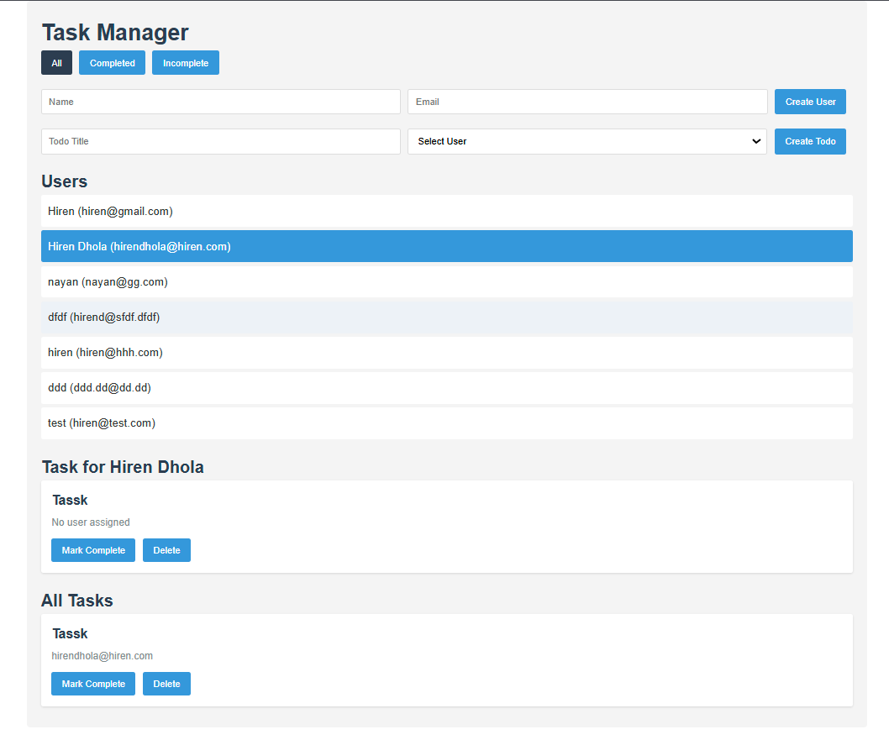

# Task Manager App

A simple task management application built with React, Apollo Client, and GraphQL.

## Overview

This application allows users to:

- Create and manage users
- Add tasks for users
- Mark tasks as complete/incomplete
- Filter tasks by status
- View user-specific tasks

## Tech Stack

- Frontend: React
- API: GraphQL
- Backend: Node.js
- Database: PostgreSQL, Prisma ORM
- State Management: Apollo Client

---
